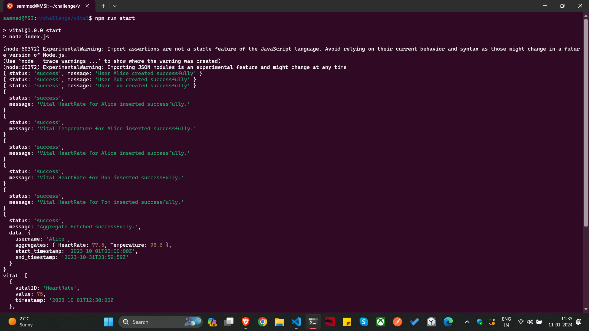

# Medical Vitals Management System

This repository contains the code for a Medical Vitals Management System. The solution focuses on efficient data structure usage, adheres to OOP design principles, promotes code reusability and modularity, and is designed to handle future additions of new vitals without major refactoring.

## Overview

The main.js file serves as the entry point for the application. It orchestrates the interaction between controllers, services, and data structures.

## Getting Started

### Prerequisites
Ensure you have the following installed:
- [Node.js](https://nodejs.org/)
- [npm](https://www.npmjs.com/)

 

### Installation
1. Clone the repository:
   ```bash
   git clone https://github.com/sammed-21/Medical-Vitals-Management-System.git
2. Navigate to the project directory:
   ``` 
   cd Medical-Vitals-Management-System
   ```
## Usage
Run the application:
```
 npm run start
```
### Code Overview
 
main.js
main.js serves as the entry point, orchestrating interactions between controllers, services, and data structures in the Medical Vitals Management System, initializing the application and managing overall flow.

## Services
UserService:
Handles user-related tasks like authentication and authorization, encapsulating logic for user operations, promoting modularity.

VitalService:
Manages medical vitals functionalities, processing and handling vital sign data, encapsulating essential logic for vital-related operations in the system.

 
## Controllers
UserController:
Manages user entity interactions, communicating with UserService, orchestrating user-related operations for a separated concern.

VitalController:
Specialized in handling interactions related to medical vitals, communicates with VitalService, managing operations related to vital signs for modular code.

## test_case.json
test_case.json contains structured test cases, likely in JSON format, for testing purposes. Each case represents a scenario to verify system functionality, aiding automated testing with input and expected output data

 
### Output



 ```

